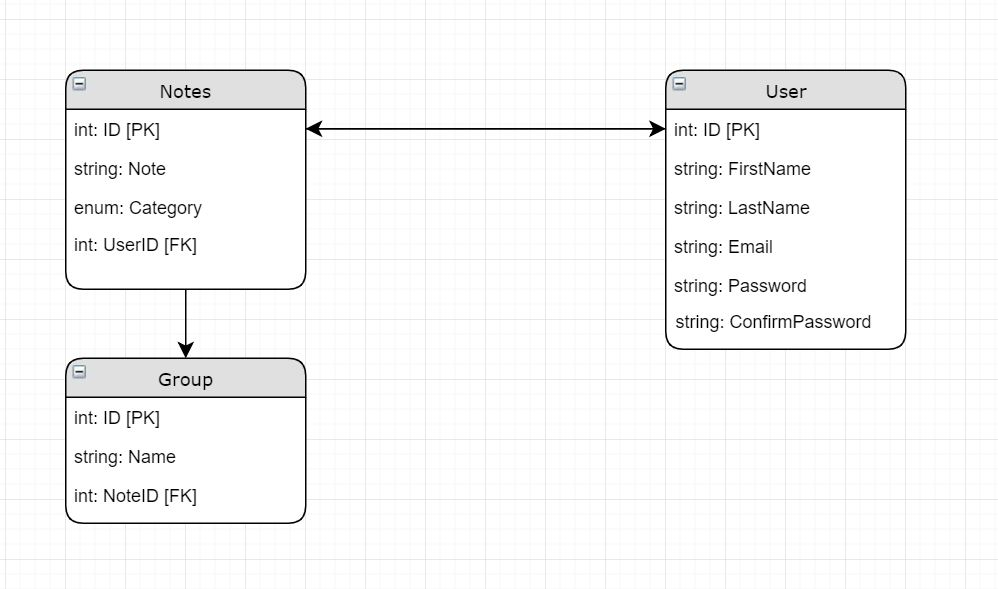

# Project Plan

## Contents
1. [Vision](#vision)
2. [Scope](#scope)
3. [Requirements](#requirements)
4. [User Stories](#user-stories)
5. [Wireframes](#wireframes)
6. [Dataflow Diagram](#dataflow-diagram)
7. [Database Schemas](#database-schema)

## Vision
The purpose of this app is to convert handwritten notes into text files for easier storage, access, and manageability. The user will be able to store notes according to categories and groups can be formed to add and share notes within the group.

## Scope
IN:
 - The web app will allow users to upload an image and convert it to text.
 - The web app will allow users to save text from images to different categories.
 - The web app will allow the user to manage different categories for notes.
 - The web app will allow users to register and log in to his/her account.
 - The web app will allow users to manage text notes in categories. 
 - User can edit text from image results.  

OUT:
 - We will only convert images to English.
  
### MVP
A user can upload an image to convert to text that can be saved to different categories. The user can edit, update, and delete categories for text notes. Users will register for an account and notes/categories will be saved to a database.
### Stretch
 - The website will save images to the user’s account as a reference.
 - The website will offer speech-to-text for saving notes. 
 - The website will be mobile-friendly (responsive)

## Requirements
### Functional Requirements
- The user can upload an image to convert to text.
- The user can add, edit, and delete notes.
- The user can add, edit, and delete category sets for notes.
- The user can register and log in to an account with notes and categories saved to a database.
- The web app will display notes and categories to the user.

### Non-Functional Requirements
* Usability
  - Intuitive Design: The UI will be designed in a way where users do not have to rely on external or extra instructions to use the web app.
  - Clean & Concise: The UI will be uncluttered and easy to follow and understand.
* Testability
  - Unit Tests: CRUD Operations 
  - The site will have a small total number of user “paths” (associated with CRUD operations) which makes it easier to test that each user path works as intended.
  - Unit Tests: Routes, Controllers & Views
  
## User Stories
Feature: As a user, I would like to be able upload an image and have the image be converted to text and stored as a note.  
Acceptance Criteria: Image correctly uploads, Image is converted to text, note is saved  

Feature: As a user, I would like to be able to create an account and log in to see my saved notes.  
Acceptance Criteria: user is identified by email, identity database to store user info, user recognized at login  

Feature: As a user, I would like to be able to edit my notes.  
Acceptance Criteria: note can be edited, edited note can be saved  

Feature: As a developer, I would like to keep my code DRY.  
Acceptance Criteria: code is well commented, does not contain unnecessary code, file does not contain zombie code  

Feature: As a user, I would like to delete a note.  
Acceptance Criteria: note will display option to delete, note will be removed from users note history  

## Wireframes

## Dataflow Diagram

## Database Schema

